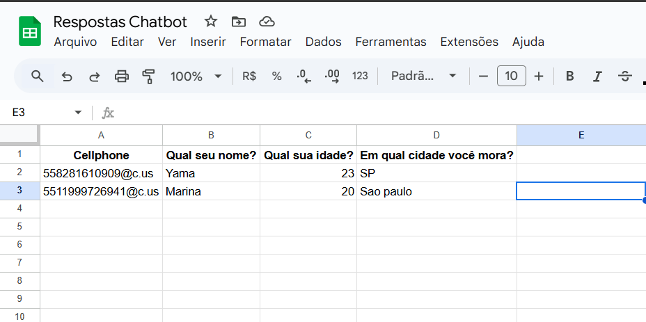

# Chatbot de Whatsapp | Gás - Social
O Bot tem como objetivo fazer perguntas pré-programadas, utilizando o **Whatsapp** como meio de comunicação. Além de armazenar as respostas do usuário em planilha no **Google Sheets**.



## Configuração do Bot
Para iniciar o Bot é preciso primeiro criar um novo projeto dentro do [**Google Cloud**](https://console.cloud.google.com/welcome?hl=pt-BR), depois de criado, é preciso adicionar a API do **Google Sheets**, às configurações do projeto, em seguida, criar uma credencial em ```APIs e Serviços > Credencias > Contas de serviço```, e baixar o ```JSON``` correspondente às credencias. 

[](image.png)

<br> 
<br> 

Por último, deve ser criado uma planilha no **Google Sheets**.

  
Além da credencial criada, será gerado um email, que será preciso compartilhar a planilha no **Google Sheets** com ele.

<br>
<br>
<br>


Existem dois arquivos de configuração, sendo eles:
1. ```.env```
2. ```config.js```

### 1. Configuração do arquivo ```.env```
Esse arquivo serve para armazenar variáveis sensíveis, assim como a credencial do **Google Cloud**, que é responsável por acessar a planilha.

Para o arquivo ```.env```, é necessário adicionar tanto as credencias para o projeto do **Google Cloud**, para acessar a api. E adicionar o ID da planilha no **Google Sheets**.

### 2. Configuração do arquivo ```config.js```
Esse arquivo, serve para definir variáveis para a funcionalidade do Bot.

Para o arquivo ```config.js```, temos algumas variáveis que podem ser setadas, dentre elas temos:
1. ```sheetName```
2. ```perguntas```

Para a variável ```sheetName```, é preciso fornecer o nome da planilha que iremos salvar as respostas do cliente.

A variável ```perguntas```, são as mensagens que serão mandadas ao cliente, sendo a primeira, a mensagem de introdução das perguntas aos clientes, em seguida vêm as perguntas, e por fim a mensagem final para finalizar a conversa. Segue um exemplo, abaixo:
```
[
    "Texto de Introdução",
    "Qual seu nome?",
    "Qual sua idade?",
    "Em qual cidade você mora?",
    "Texto de Finalização"
]
```